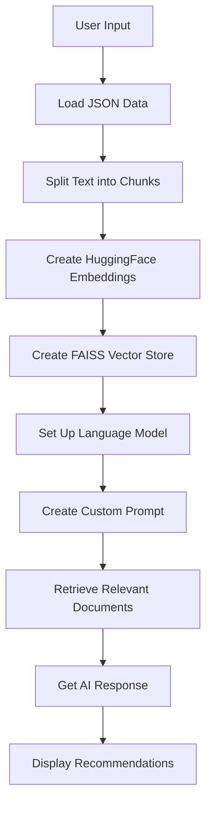

# Book Whiz

This program provides book recommendations based on user inputs such as Author, Category, Price, and Stock using advanced language models and vector databases.

## Features

- 📚 Provides book recommendations from a JSON database
- 🔍 Utilizes HuggingFace embeddings for semantic search
- 🧠 Uses ChatGroq for AI-based responses
- 📊 Employs FAISS for efficient vector storage and retrieval

## Workflow



## Installation

```bash
pip install langchain_community langchain_groq groq sentence-transformers
```

## Usage

1. **Load and Split JSON Data**

    ```python
    from langchain_community.document_loaders import PyPDFLoader
    from langchain.text_splitter import RecursiveCharacterTextSplitter
    from langchain.docstore.document import Document
    from pathlib import Path
    from typing import List
    import json

    class JSONLoader:
        def __init__(self, file_path: str, content_keys: List[str]):
            self.file_path = Path(file_path)
            self.content_keys = content_keys

        def load(self) -> List[Document]:
            with self.file_path.open() as f:
                data = json.load(f)
            documents = []
            for item in data:
                content = " ".join(f"{key}: {item.get(key, '')}" for key in self.content_keys)
                metadata = {key: item.get(key) for key in item.keys() if key not in self.content_keys}
                doc = Document(page_content=content, metadata=metadata)
                documents.append(doc)
            return documents

    file_path = "data.json"
    content_keys = ["Book Title", "Author", "Price", "Stock", "Category"]
    loader = JSONLoader(file_path, content_keys)
    documents = loader.load()
    ```

2. **Split Text into Chunks**

    ```python
    from langchain.text_splitter import RecursiveCharacterTextSplitter

    text_splitter = RecursiveCharacterTextSplitter(chunk_size=1000, chunk_overlap=200)
    chunks = text_splitter.split_documents(documents)
    ```

3. **Create HuggingFace Embeddings**

    ```python
    from langchain_community.embeddings import HuggingFaceEmbeddings

    embeddings = HuggingFaceEmbeddings(model_name="sentence-transformers/all-MiniLM-L6-v2")
    ```

4. **Create FAISS Vector Store**

    ```python
    from langchain_community.vectorstores import FAISS

    vector_db = FAISS.from_documents(chunks, embeddings)
    ```

5. **Set Up Language Model**

    ```python
    from langchain_groq import ChatGroq

    local_model = "mixtral-8x7b-32768"
    llm = ChatGroq(model=local_model)
    ```

6. **Create Custom Prompt**

    ```python
    from langchain.prompts import ChatPromptTemplate, HumanMessagePromptTemplate, SystemMessagePromptTemplate

    def create_custom_prompt():
        system_template = """You are an AI assistant that provides Book Recommendations to customers. Your knowledge comes from a database containing information about Book Title, Price, Stock, and their corresponding Authors.

        Rules:
        - Given an Author, Category, and Stock, provide the best available books related to the customer query.
        - Give three book recommendations from the file.
        - If no exact match is found, say Error.
        - Always aim for accuracy and relevance in your recommendations.
        - Keep your responses concise and focused on the recommendations.
        - Just give the Book Names And Their Stock
        - Only use the database do not create books on your own.
        - Just give the book names and details and nothing else

        Chat History:
        {chat_history}
        """
        
        human_template = """Context: {context}

        User Input:
        Author: {Author}
        Category: {Category}
        Price: {Price}
        Stock: {Stock}

        Task: Provide the most relevant solution(s) for the given issue.
        """
        
        system_message_prompt = SystemMessagePromptTemplate.from_template(system_template)
        human_message_prompt = HumanMessagePromptTemplate.from_template(human_template)
        
        return ChatPromptTemplate.from_messages([system_message_prompt, human_message_prompt])

    prompt = create_custom_prompt()
    ```

7. **Retrieve Relevant Documents and Get AI Response**

    ```python
    from langchain.memory import ChatMessageHistory
    from langchain_core.runnables import RunnablePassthrough

    retriever = vector_db.as_retriever(search_kwargs={"k": 3})

    def format_docs(docs):
        return "\n\n".join(doc.page_content for doc in docs)

    chat_history = ChatMessageHistory()

    def get_chat_history():
        return "\n".join([f"{message.type}: {message.content}" for message in chat_history.messages])

    def get_response(input_dict):
        context = format_docs(retriever.get_relevant_documents(f"{input_dict['Author']} {input_dict['Category']} {input_dict['Stock']}"))
        chat_history_str = get_chat_history()
        
        messages = prompt.format_messages(
            context=context,
            Author=input_dict['Author'],
            Category=input_dict['Category'],
            Price=input_dict['Price'],
            Stock=input_dict['Stock'],
            chat_history=chat_history_str
        )
        
        response = llm(messages)
        return response.content

    chain = RunnablePassthrough() | get_response
    ```

8. **Filter Books by Price**

    ```python
    def filter_books_by_price(documents, user_price):
        affordable_books = []
        for doc in documents:
            content = doc.page_content
            metadata = doc.metadata
            book_price = float(metadata.get("Price", 0))
            if user_price >= book_price:
                affordable_books.append(doc)
        return affordable_books
    ```

9. **Chat Function**

    ```python
    def chat():
        print("AI: Hello! I'm here to help with book recommendations. Please provide the following information:")
        
        while True:
            Author = input("Enter the author: ")
            if Author.lower() in ['quit', 'exit', 'bye']:
                print("AI: Thank you for using our service. Have a great day!")
                break

            Category = input("Enter the category: ")
            if Category.lower() in ['quit', 'exit', 'bye']:
                print("AI: Thank you for using our service. Have a great day!")
                break

            Price = input("Enter your price: ")
            if Price.lower() in ['quit', 'exit', 'bye']:
                print("AI: Thank you for using our service. Have a great day!")
                break

            Stock = input("Enter the stock: ")
            if Stock.lower() in ['quit', 'exit', 'bye']:
                print("AI: Thank you for using our service. Have a great day!")
                break

            try:
                user_price = float(Price)
                relevant_documents = retriever.get_relevant_documents(f"{Author} {Category} {Stock}")
                affordable_books = filter_books_by_price(relevant_documents, user_price)
                response = get_response({"Author": Author, "Price": Price, "Stock": Stock, "Category": Category})

                if affordable_books:
                    print("\nAI:", response)
                else:
                    print("\nAI: Sorry, no books are available within your budget.")

                chat_history.add_user_message(f"Author: {Author}, Category: {Category}, Price: {Price}, Stock: {Stock}")
                chat_history.add_ai_message(response)

            except Exception as e:
                print(f"An error occurred: {e}")

            print("\nIs there anything else you'd like help with?")

    if __name__ == "__main__":
        chat()
    ```

```
